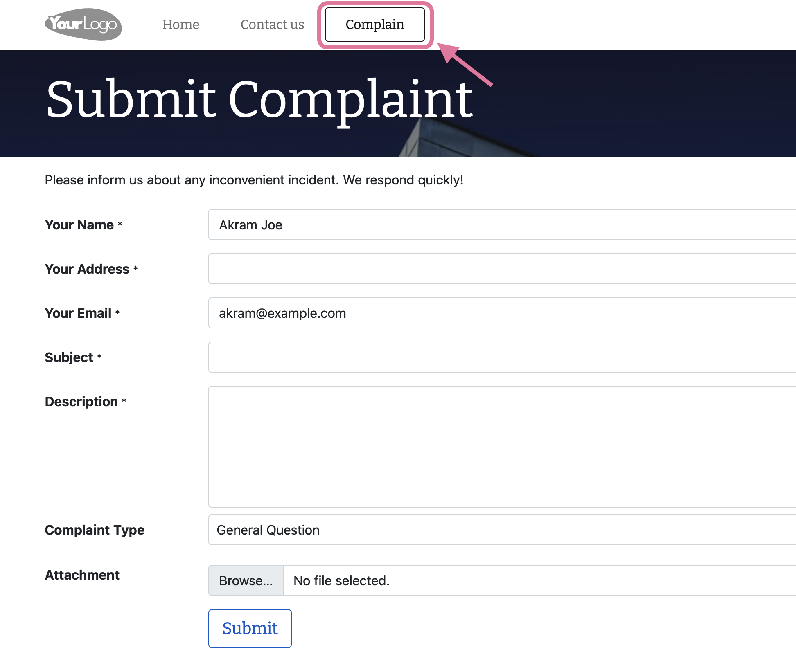
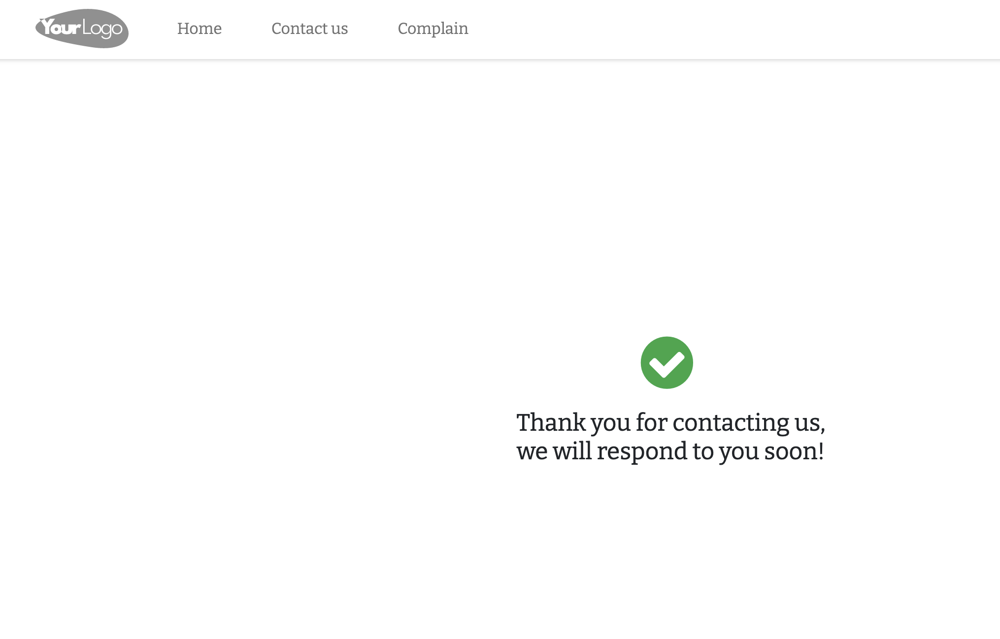
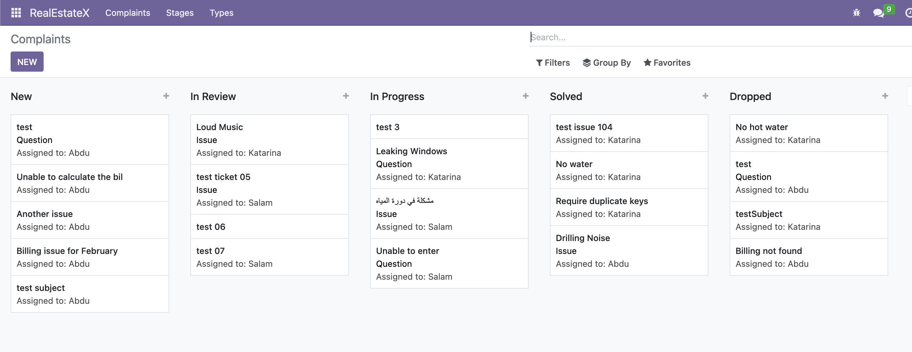
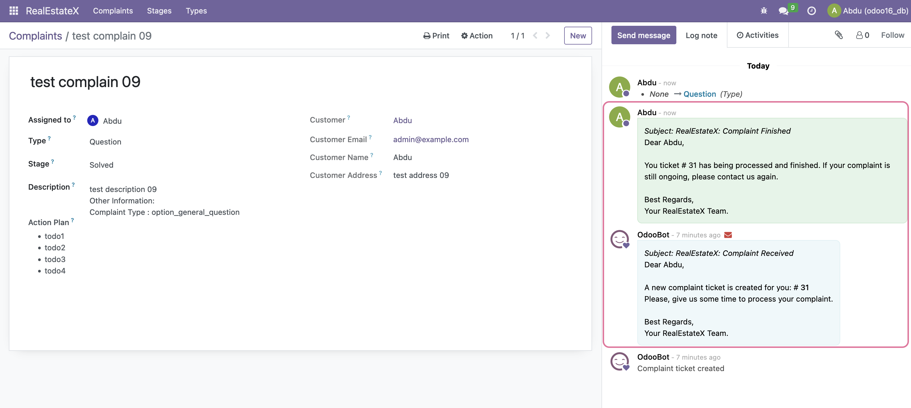
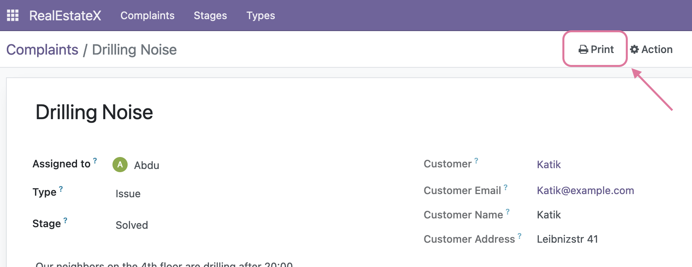
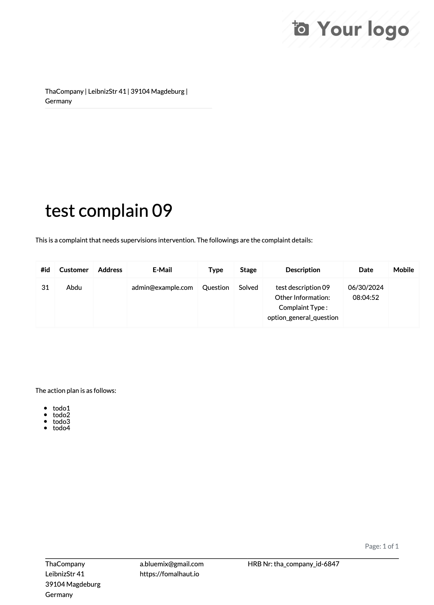
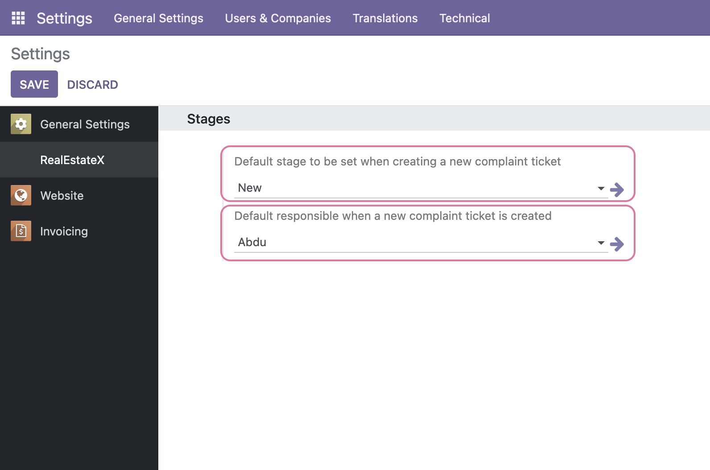

RealEstateX
=======================
Developing a complaint form Odoo module for a real estate company in Germany that provides
a form on their website for tenants to submit complaints about their rented flats.
These complaints will then be classified and dealt with by RealEstateX’s employees.


Installation
=======================

Git clone this repo into your custom `addons` path, then execute the following command line
using Docker:
```docker
docker exec -it <odoo_container_id> bash -c "odoo -d <odoo_db_name> -i real_estatex_bloopark"
```

Technical Documentation
=======================

User Documentation
=======================

### Website Form
The process of creating and managing complaints starts when the user submits the complaint
using the website form, where there will be a new _Complain_ button that is added at the top menu bar
as shown:




When the entered information is validated, the Submit button will create a new complaint ticket
at the backend and a success webpage is shown to the user:



### Backoffice

Now, if you go to the _RealEstateX_ module, you'll the new submitted ticket, and its stage (usually it is
the New stage -- the default Stage can be configured from the module Settings):



Inside the complaint, you can see the emails sent:



and you can also _print_ the complaint, by clicking on the _Print_ button:



which will produce the following PDF:



### Settings Configuration

There are different stages for the tickets, and when a new ticket is created, it is 
also assigned automatically to a responsible/assignee, from the module Settings:



Here, the default stage is set to _New_, and the default assignee is _Abdu_.


