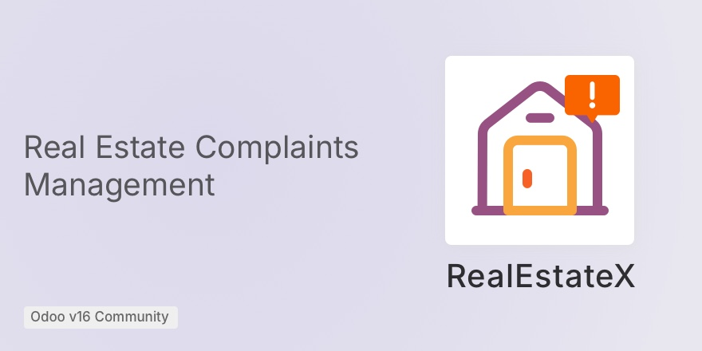

RealEstateX
=======================
Developing a complaint website form Odoo module for a real estate company in Germany that provides
a form on their website for tenants to submit complaints about their rented flats.
These complaints will then be classified and dealt with by RealEstateX’s employees.


Installation
=======================

### Docker
Git clone this repo into your custom `addons` path, then execute the following command line
using Docker:
```docker
docker exec -it <odoo_container_id> bash -c "odoo -d <odoo_db_name> -i real_estatex_bloopark"
```

### Running tests in a Docker container

```docker
docker exec -it <odoo_container_id> bash -c "odoo -p <port> -d <test_db_name> -r <db_username> -w <db_password> --db_host=<db_host> --db_port=<db_port> -i real_estatex_bloopark  --test-enable --stop-after-init"
```
Example:

```docker
docker exec -it odoo16_community bash -c "odoo -p 5050 -d odoo16_db_test -r odoo -w odoo --db_host=db --db_port=5432 -i real_estatex_bloopark --log-level=test --test-enable --stop-after-init --test-enable --stop-after-init"
```
or to execute specific test case example:
```docker
docker exec -it odoo16_community bash -c "odoo -p 5050 -d odoo16_db_test -r odoo -w odoo --db_host=db --db_port=5432 -i real_estatex_bloopark --log-level=test --test-enable --stop-after-init --test-enable --stop-after-init --test-tags /real_estatex_bloopark:ComplaintsTests.test_default_settings"
```

Technical Documentation
=======================
### Overview

The basic model here is the `complaint.ticket`, where most of the processing or flows are happened in it.
It inherits from `mail.thread`, because emails are sent from it multiple times.

Generally, the `complaint.ticket` is linked to the following models:


Each ticket is linked to a responsible/assignee (`res.user`), a stage (`complaint.stage`), a complaint type (`complaint.type`) 
and a contact (`res.partner`).

The default responsible and the default stage can be set from the `res.config.settings`.

### Website forms

There are two website pages created in this module. One that is about submitting a new complaint,
located in `views/complaint_template.xml` and another one when a new complaint is received and created,
located in `views/complaint_submitted_template.xml`


### Email templates

When a new complaint is created or when the complaint is finished (dropped or solved), the templates 
`data/complaint_received_mail_template` and `complaint_finished_template.xml` respectively.
Those templates are called from `complaint.ticket`'s `send_email`.


User Documentation
=======================

### Website Form
The process of creating and managing complaints starts when the user submits the complaint
using the website form, where there will be a new _Complain_ button that is added to the main pages (next to _Contact us_)
as shown here for example:


When the entered information is validated, the Submit button will create a new complaint ticket
at the backend and a success webpage is shown to the user:


### Backoffice

Now, if you go to the _RealEstateX_ module, you'll the new submitted ticket, and its stage (usually it is
the _New_ stage — the default Stage can be configured from the module Settings):


Inside the complaint, you can see the emails sent:


and you can also _print_ the complaint, by clicking on the _Print_ button:


which will produce the following PDF:


### Settings Configuration

There are different stages for the tickets, and when a new ticket is created, it is 
also assigned automatically to a responsible/assignee, from the module Settings:


Here, the default stage is set to _New_, and the default assignee is _Abdu_.

